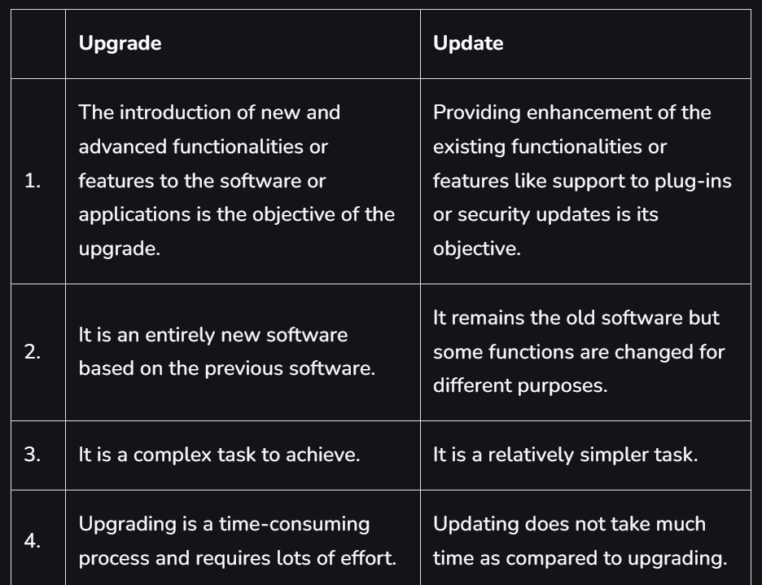

kubaws ec2 describe-images --image-ids ami-0fc5d935ebf8bc3bc --region us-east-1

************************************************

hashing algorithms are used to generate random numbers
To understand git we will be using two plumbing commits
git cat-file -t 8414636
it tells  type of what you are looking at
git cat-file -p 8414636
it prints type of values
git doesnot have parent is called first commit

now we have 3 commits
Preview
blob--file

###################
INSTALL TERRAFORM ON UBUNTU
-----------------------------------
#!/bin/bash
sudo apt-get update && sudo apt-get install -y gnupg software-properties-common
wget -O- https://apt.releases.hashicorp.com/gpg | \
gpg --dearmor | \
sudo tee /usr/share/keyrings/hashicorp-archive-keyring.gpg
gpg --no-default-keyring \
--keyring /usr/share/keyrings/hashicorp-archive-keyring.gpg \
--fingerprint
echo "deb [signed-by=/usr/share/keyrings/hashicorp-archive-keyring.gpg] \
https://apt.releases.hashicorp.com $(lsb_release -cs) main" | \
sudo tee /etc/apt/sources.list.d/hashicorp.list
sudo apt update
sudo apt-get install terraform -y
terraform -install-autocomplete

#############
INSTALL AS CLI ON LINUX
sudo apt install unzip curl -y
curl "https://awscli.amazonaws.com/awscli-exe-linux-x86_64.zip" -o "awscliv2.zip"
unzip awscliv2.zip
sudo ./aws/install

#DOCKER INSTALL 
#!/bin/sh
# Docker CE for Linux installation script
#
# See https://docs.docker.com/engine/install/ for the installation steps.
#
# This script is meant for quick & easy install via:
#   $ curl -fsSL https://get.docker.com -o get-docker.sh
#   $ sh get-docker.sh
#
# For test builds (ie. release candidates):
#   $ curl -fsSL https://test.docker.com -o test-docker.sh
#   $ sh test-docker.sh

Dockerfile Introduction
In this section we would cover Dockerfiles and instructions.
Dockerfile is a simple plain text file that contains set of user defined instructions which will be call during building the image.
Click here for Dockerfile reference
Syntax
Generic Syntax is INSTRUCTION arguments for eg FROM alpine or RUN echo 'Hello'
Dockerfile should start with a FROM instruction which specifies the base image.
Docker File Instructions
FROM:

Syntax is FROM <image>[:tag] [As <name>].
note: any thing in [] above are optional
This instruction sets the base image.
Multiple FROM statements are also allowed to support multistage builds
Refer here for more info
LABEL :

Adds metadata to the image
Refer Here for more info.
RUN :

This command takes arguments in two forms
Shell form: RUN <command>
In this command runs in a shell
exec form: RUN ["executable", "param1", "param2" ]
In this way comand execution doesn’t require a defaault shell
Each RUN instruction will execute the commands in the new layer on top of current image
Refer Here for more info.
COPY

copies file from soure to destination.
Syntax: COPY <src> <dest>
src in above syntax is only files and directories . URL’s are not supported
Refer Here for more info
ADD

copies file from soure to destination.
Syntax: ADD <src> <dest>
src in above syntax is only files and directories . URL’s are supported as source.
Refer Here for more info
ENTRYPOINT

Command which gets executed when the docker container is created from image.
CMD acts as argument to the ENTRYPOINT
Refer Here for more info
CMD

Refer Here for more info
TO understand CMD and ENTRYPOINT interatction refer here
EXPOSE

Refer Here
Building an Image
Lets build a spring-pet-clinic app image

Manually to execute spring pet clinic

Clone from Github using the following HTTPS url. git clone https://github.com/spring-projects/spring-petclinic.git

Ensure Java and maven are installed.

Execute the following command to build the image mvn package

Copy spring-petclinic*.jar file from target folder to any folder in your linux machine.

Execute the following command to run the container “` java -jar spring-petclinic*.jar“

From the above understanding lets write the Dockerfile

Create a new directory called as spring-petclinic
Create a file called as Dockerfile
Copy the spring-petclinic.jar to samefolder
Insert the following contents
FROM openjdk:8
LABEL author="KHAJA"
LABEL version="1.0"
COPY ./spring-petclinic.jar /spring-petclinic.jar
EXPOSE 8080
ENTRYPOINT ["java", "-jar"] 
CMD ["/spring-petclinic.jar"]
Execute the docker image build command docker image build -t springpetclinic:1.0 .
Try to create container with following command
docker container run -d -p 8080:8080 springpetclinic:1.0
Lets examine the layers

Execute the following command docker image inspect openjdk:8
Navigate to Layers and have a look at highlighted layers Preview
Total we have seven layers
Now execute the following command docker image inspect springpetclinic:1.0 and Navigate to layers section

DOCKER COMMANDS:
###image naming convention
[username]/[repository]:[<tag>]
shaikkhajaibrahim/myspc:1.0.1
username => shaikkhajaibrahi
repository => what image => myspc
tag => version => 1.0.1
===================================
default tag is latest
nginx
nginx:latest
==============================
official images dont have username
nginx
ubuntu
alpine
shaikkhajaibrahim/myspc
=============================================
Lets pull the image from docker hub nginx with tag 1.23
docker image pull nginx:1.23
docker image ls
===================================
Remove images from local
`docker image rm $(docker image ls -q)
===============================
Create a container with nginx
docker container run -d nginx
"-d"--->detached mode 
===================================
Remove all the running containers 
docker container rm -f $(docker container ls -q )
========================
Remove specific container
docker container rm nginx1
Remove all containers 
docker container rm -f $(docker container ls -a -q )
=======================
Docker container lifecycle
Docker lifecycle states
Created
Running
Paused
Stopped
Deleted
======================
Port-forwording
ommand: docker container run -d -p <host-port>:<container-port> <image>
Create a nginx container and expose on port 30000 
docker container run -d -p 30000:80 --name nginx1 nginx
----------------------------------------
Create a jenkins container & expose 8080 port on 30001 port of host
 docker container run -d -p 30001:8080 --name jenkins1 jenkins/jenkins
=====================================
Dockerfile based Image building
Springpetclinic Dockerfile
FROM amazoncorretto:11
RUN curl https://referenceapplicationskhaja.s3.us-west-2.amazonaws.com/spring-petclinic-2.4.2.jar -o spring-petclinic-2.4.2.jar
EXPOSE 8080
CMD ["java", "-jar", "spring-petclinic-2.4.2.jar"]
---------------------------------------
To build docker image 
docker image build -t myspc:corretto11
To run the container 
docker container run -d -P --name sridhar myspc:corretto11
----------------------------------------
Approach 2: Start from some os
FROM alpine:3
RUN apk add openjdk11
RUN wget https://referenceapplicationskhaja.s3.us-west-2.amazonaws.com/spring-petclinic-2.4.2.jar
EXPOSE 8080
CMD ["java", "-jar", "spring-petclinic-2.4.2.jar"]
To build  the image 
docker image build -t myspc1:alpine
To build container 
docker container run -d -P --sri myspc1:alpine

*********************************************************
Install python onn 

** Install python/pip**

apk add update
apk add --update --no-cache python3 && ln -sf python3 /usr/bin/python
python3 -m ensurepip
pip3 install --no-cache --upgrade pip setuptools
--------------------------------------------------------------

---------------------------------------------

FROM ubuntu:22.04
LABEL Author="Sridhar" Organization="QT" Project="Learning"
RUN apt update
RUN apt install openjdk-11-jdk -y 
RUN apt install curl -y
RUN curl -fsSL https://pkg.jenkins.io/debian-stable/jenkins.io-2023.key |  tee \
  /usr/share/keyrings/jenkins-keyring.asc > /dev/null
RUN echo deb [signed-by=/usr/share/keyrings/jenkins-keyring.asc] \
  https://pkg.jenkins.io/debian-stable binary/ |  tee \
  /etc/apt/sources.list.d/jenkins.list > /dev/null
RUN apt update && apt install jenkins -y
EXPOSE 8080 
CMD ["/usr/bin/jenkins"]

 ###############################################
 ******************   
Create container Postgress
    docker container run --name postgresq -e POSTGRES_USER=panoramic -e POSTGRES_PASSWORD=trekk
ing -e POSTGRES_DB=psqldata -d -P postgres:15
docker exec -it postgresq /bin/bash
psql -U panoramic -W trekking -d psqldata
\l
psqldata=# use emloyees;
ERROR:  syntax error at or near "use"
LINE 1: use emloyees;
        ^
psqldata=# CREATE TABLE Persons (
    PersonID int,
    LastName varchar(255),
    FirstName varchar(255),
    Address varchar(255),
    City varchar(255)
);
CREATE TABLE
psqldata=# Insert into Persons Values (1,'test','test', 'test', 'test');
INSERT 0 1
psqldata=# Select * from Persons;
 personid | lastname | firstname | address | city
----------+----------+-----------+---------+------
        1 | test     | test      | test    | test
(1 row)

--------------------------------------------------------------
Try creating dockerfile which runs on phpinfo page,user ARG & ENV whereever appropriate a) on apache server   b)on nginx server

FROM ubuntu/apache2
LABEL Author="Sridhar" Organization="QT" Project="Learning"
RUN apt update
RUN apt install php libapache2-mod-php -y
RUN apt install php-cli -y 
RUN apt install php-cgi -y 
RUN apt install php-mysql -y 
RUN apt install php-pgsql -y
RUN echo "<?php phpinfo(); ?>" >> /var/www/html/# info.php
EXP
OSE 80

Try creating dockerfile which runs on phpinfo page,user ARG & ENV whereever appropriate  b)on nginx server

FROM ubuntu/nginx
LABEL Author="Sridhar" Organization="QT" Project="Learning"
RUN apt-get update && apt-get upgrade 
RUN nginx -v
RUN nginx -t
RUN systemctl stop nginx.service
RUN systemctl start nginx.service
RUN systemctl enable nginx.service
RUN systemctl restart nginx.service
##  Step 2: PHP Install and Version Check
RUN apt-get -y install php7.0 php7.0-fpm -y
RUN apt-get upgrade
RUN systemctl status php7.0-fpm
RUN cd ~
RUN cd /etc/nginx
RUN cd etc/php/
RUN vim 7.0/fpm/php.ini
RUN cp php.ini php.ini_copy
RUN systemctl restart nginx.service
RUN vim /var/www/html/phpinfo.php
RUN echo "<?php phpinfo(); ?>" >> vim /var/www/html/phpinfo.php
EXPOSE 80

*************************************************************
1.docker network create mybridge
2.docker run -d --network mybridge --name mysri -v myvolume:/var/lib/mysql -e MYSQL_ROOT_PASSWORD=sridhar -e MYSQL_DATABASE=employees -e MYSQL_USER=qtdevops -e MYSQL_PASSWORD=rootroot mysql:8
  vi Dockerfile
3.docker image build -t nopimage:4.60.2 .
4.docker container run -d -P --network mybridge --name nop -v myvolume:/var/lib/mysql -e     
   MYSQL_ROOT_PASSWORD=sridhar -e MYSQL_DATABASE=employees  nopimage:4.60.2

+++++++++++++++++++++++++++++++++++++++++++++++++++++++++++++++++++++++++++++
Method-II
==========
docker network create --driver bridge nop-net
docker volume create nop-db
docker container run --name mysql --network nop-net -d \
    -e MYSQL_ROOT_PASSWORD=rootroot \
    -e MYSQL_USER=nop \
    -e MYSQL_PASSWORD=rootroot \
    -v nop-db:/var/lib/mysql \
    mysql:8
vi Dockerfile
docker container run --name nop --network nop-net \
    -P -d nop:4.60.2
    In the install page, pass connection string
server=mysql;uid=root;pwd=rootroot;database=nop
------------------------------------------------------------------------------
Docker Workshop -3 
 &&&&&&&&&&&&&&&&&&&&&&&&&&&&&&&&&&&&&&&
1.	Create a multistage docker file to build  
a.	nop commerce  
b.	spring petclinic 
FROM alpine/git AS vcs
RUN cd / && git clone https://github.com/spring-projects/spring-petclinic.git && \
    pwd && ls /spring-petclinic

FROM maven:3-amazoncorretto-17 AS builder
COPY --from=vcs /spring-petclinic /spring-petclinic
RUN ls /spring-petclinic 
RUN cd /spring-petclinic && mvn package

FROM amazoncorretto:17-alpine-jdk
LABEL author="khaja"
EXPOSE 8080
ARG HOME_DIR=/spc
WORKDIR ${HOME_DIR}
COPY --from=builder /spring-petclinic/target/spring-*.jar ${HOME_DIR}/spring-petclinic.jar
EXPOSE 8080
CMD ["java", "-jar", "spring-petclinic.jar"]
--------------------------------------------------
c.	student courses register 
FROM python:3.7-alpine
LABEL author=SRIDHAR
LABEL blog=directdevops.blog
ARG HOME_DIR='/studentcourses'
ADD . $HOME_DIR
ENV MYSQL_USERNAME='directdevops'
ENV MYSQL_PASSWORD='directdevops'
ENV MYSQL_SERVER='localhost'
ENV MYSQL_SERVER_PORT='3306'
ENV MYSQL_DATABASE='test'
EXPOSE 8080
WORKDIR $HOME_DIR
RUN pip install -r requirements.txt
ENTRYPOINT ["python", "app.py"]

-----------------------------------------------------
git clone https://github.com/DevProjectsForDevOps/StudentCoursesRestAPI.git
cd StudentCoursesRestAPI
docker image build -t scr:latest
docker network create -d bridge scr_bridge
docker volume create scr_db
docker container run -d --name mysql -e MYSQL_ROOT_PASSWORD=password -e MYSQL_DATABASE=test -e MYSQL_USER=directdevops -e MYSQL_PASSWORD=directdevops --network scr_bridge -v scr_db:/var/lib/mysql mysql:5.6
docker container run -d --name mypythonapp -e MYSQL_SERVER=mysql --network scr_bridge -P scr:latest
+++++++++++++++++++++++++++++++++++++++++
2.	Push the images to  
a.	AWS ECR 
b.	Azure ACR 
--------------------------------------------------
3.	Write a docker compose file for 
a.	Nop Commerce 
---
version: "3.9"
services:
  nop:
    build:
      context: .
      dockerfile: Dockerfile
    networks:
      - nop-net
    ports:
      - "35000:5000"
    depends_on:
      - nop-db

  nop-db:
    image: mysql:8
    networks:
      - nop-net
    volumes:
      - nop-db:/var/lib/mysql
    environment:
      - MYSQL_ROOT_PASSWORD=rootroot
      - MYSQL_USER=nop
      - MYSQL_PASSWORD=rootroot
      - MYSQL_DATABASE=nop
volumes:
  nop-db:
networks:
  nop-net:
  --------------------------------------
b.	Spring petclinic 

c.	Game of life 
d.	Student Courses Register 
---------------------------------------------
FROM 
RUN wget https://github.com/wakaleo/game-of-life.git

apt update
    2  git -version
    3  apt install git
    4  git clone https://github.com/wakaleo/game-of-life.git
    5  ls
    6  cd game-of-life/
    7  ls
    8  apt install openjdk-8-jdk maven -y
    9  mvn --version
   10  java -version
   11  mvn -version
   12  history

====================================================================================
   ____________________________________________________________________________________-
   _____________________________________________________________________________________
   To export the java PATH 
   ++++++++++++++++++++++++++++++++++++++++++++++++++++++++++++++++++++++

   export PATH="/usr/lib/jvm/java-1.8.0-openjdk-amd64/bin:$PATH"

  ++++++++++++++++++++++++++++++++++++++++++++++++++++++++++++++++++++++++
 
==============================================================================================

pipeline {
    agent { label 'openjdk-17' }
    stages {
        stage('git') {
            steps {
                git branch: 'main', url: 'https://github.com/wakaleo/game-of-life.git'
            }
        }
        stage('build') {
            steps {
                sh 'mvn package'
            }
        }
    }
}

ipeline {
    agent { label 'JDK-17' }
    stages {
        stage('git') {
            steps {
                git branch: 'master', url: 'https://github.com/dummyrepos/spring-petclinic-1.git'
            }
        }
        stage('build') {
            steps {
                sh 'mvn package'
            }
        }
    }

    pipeline {
    agent { label 'openjdk-8' 
    stages {
        stage('git') {
            steps {
                git branch: 'master', url: 'https://github.com/wakaleo/game-of-life.git'
            }
        }
        stage('build') {
            steps {
                sh 'mvn package'
                
                
            }
        }
    }

&&&&&&&&&&&&&&&&&&&&&&&&&&&&&&&&&&&&&&&&&&&&&&&&&&&&&&&&&&&&&&&&&&&&&&&&&&&&&&&&&&&&&&&&&&&&&&&&&&&&&&&&&&&&&&&&&&&7
Roles and Responsibilities:
* Make sure that the pipeline is running smoothly — This is one of the most important tasks of a DevOps engineer to make sure that CI/CD pipeline is intact and fixing any issue or failure with it is the #1 priority for the day. They often need to spend time troubleshooting, analysing and providing fixes to issues.
* Interaction with other teams — Coordination and collaboration is the key for DevOps to be successful and hence daily integration with Dev and QA team, Program Management, IT is always required.
* Work on Automation Backlog — Automation is the soul of DevOps so DevOps engineering need to plan it out and I can see DevOps engineer spending lots of time behind the keyboard working on Automating stuff on a daily basis.
* Infrastructure Management — DevOps engineers are also responsible for maintaining and managing the infrastructure required for CI/CD pipeline and making sure that it’s up and running and being used optimally is also part of their daily schedule. Working on Backup, High Availability, New Platform setup etc.
* Dealing with Legacy stuff — Not everyone is lucky to work on latest and newest things and DevOps engineers are no exception hence they also need to spend time on legacy i.e., in terms of supporting it or migrating to the latest.
* Exploration — DevOps leverage a lot from the various tools which are available, there are many options as open source, so the team needs to regularly check on this to make sure the adoptions as required, this is something that also requires some effort not on a daily but regular basis. What are open-source options available to keep the cost at a minimum?
* Removing bottleneck — DevOps’s primary purpose is to identify the bottlenecks / Manual handshakes and work with everyone involved (Dev / QA and all other stakeholders) to remove them so the team spend a good amount of time in finding such things and build the Automation Backlog using this. How we can get builds faster?
* Documentation — Though Agile / DevOps stresses less on the documentation, it is still the important one that DevOps engineer does on daily basis, Be it Server Information, Daily Week charted, Scrum / Kanban board, or Simple steps to configure / backup or modify the infrastructure, you need to spent a good amount of time in coming up these artifacts.
* Training and Self Development — Self-learning and Training are very useful in getting a better understanding and many organizations encourage their employee to take the time out and do some of these and same holds true for DevOps folks as well, So learn something new everyday…
* Continuous Improvement as Practice — Last but not least, It’s up to the DevOps folks to build awareness of the potential of CI/CD and DevOps practices and building a culture of leveraging it for doing things better, reducing re-work, increasing productivity and optimizing the use of existing resources.

************************************************************************************************************
To find the location of file in linux:::
sudo find / -type f,d,l -iname apche2.* 

sudo find / -type d -iname nginx
---> To remove the apache 
sudo apt purge apace2.

**************************************************************************************
kops get ig nodes
ku get cluster -o yaml
nano .bashrc
source .bashrc
tmax(ctrl+p+shift)---> to adjust yaml
ll .ssh/
watch kops valodate cluster

* Mostl used commands in Real time 
* get,update,upgrade,validate,rolling update(instance level upgrade
ku get pods -A
** If we delete namespace everything inside it will be deleted.
* Pod will any any no of containers.Foe all these containers have only one IP addresss i.e pod's ip address
  ## Pod----> Docker run && Deployrment---->Docker service
  * alias ku='kubectl'
  * kubectl run testpod1 --image=ngix:latest(we can give our own repo image name)
  * ku edit pod <podname>
  * ku expose pod <podname> --port=8000 --target-port=80 --type=NOdePort(to exposre the pod outside)
  * -----------------------
  * curl http://localhost:8888
  * ku port-forward pog/testpod2 8888:80
  * kubectl exec pods -it -- /bin
  * kube calic
  * calico:third party plugin will provode network and communicates between pods.
  * kubectl
  * kubeadmin
  * ku craete -f pod-yaml
  * ku get pods -n ns1 
    ku get pods -n ns2
    ku get pods -n ns1 -o  yaml
    ku exec -it memory-pod -n ns1 -- bash
    ping 100.0.2.45
## Runcontainerrun error--> is due unable to fing the image
   *kubectl get pods -l name=dev(decisison making)
   Using lables we can decision making ang by annotations randomly making
   
   kubectl get pods mypod --show=lables

=====================================================================================
## Difference between main and master?
* If we create a repo in github by default if we select main branch will create.If we dont select readme.txt file by default master branch will create.So that we can tranfer data to local to remote.

## Which linux  version are u using in project?
* amazon and ubuntu

## Difference between amazon and ubuntu?
* basic commands,
* wget and curl present by default in amazon but in linux we need to install.(yum and update)

##  wget and curl
## awk :{ --> it is used to search for 
## Free space chk? df -h
## what is group purpose
## Which users are belonging to perticular group--->get
## quality profile in sonar?
* to chek the code quality ,continuous inspection of code quality and regenerate report of code quality.the bugs,security and vulnarabiliies ,code smells.
  ## If code bugs,fails what will do?

## What is master and slave ?
* Master is responsible  for managing all slaves nodes(instances).If 

## Ther are 10 jobs in master suddenly ,If the master is went ..how can i run those jobs?
* We have default path in jenkins /var/lib/jenkins,there we found the jobs..need to the backups from existing servers..by the help of volumes we need take the backups.
* I will associate that volumes with new instance,so nwe instance will have all jobs so that we can access those.

## Jenkins pipeline syntax??
## What is the available stages in jenkins
* git,build,test,deploing in preprod server,testing entire code in selenium,deployee in production.

## can u write one more stage in pipeline??
*If we gave same name to steps 

## First stage got failed what about the second step?
Depend on configurations......."post build actions"---> always,success,failue

## What are the plugins used in Jenkins?
For artifactory___>artifactory
Role based ---> authentication
for code quality ckek---> sonar qube
## I have 2 jobs whenn i trigger one job that job should trigger another job .How we can achive this??
* There is option in UI ""build after another ".But i need pipeline
* So one is CI and another is CD job ..how to run one after another++++++++++++++++++++++++++++++++

## Can u write ansible playbook?(git install syntax)
* ---
* - host: dev
*  user: ansible
*  become: yes
*  connectin:ssh
*    Taks:
*      - name: installing git in remote machine
*        ansible.builtin.git:
*         repo:
*         dest:

## What is become: yes(acts as root user)
* Basically we r using ansble user .Ifwe trying to install git in remote we need use ----> yum install git -y
* If we trying to install with non root user like EC2...need to use sudo ...So here become:yes acts root user

## Explain in which senario use ansible??
There are the multiple (100)servers in different environments
When developer want to clone code ..in each server need git to be installed ...at thet situation we need CONFIGUREto install git by writing playboks all 100 machines...for this we use ANSIBLE

## How to copy files from one server to another server.
By playbook = - or inventary
ansible

## Docker is used to create containers.
* It is a containarization tool,which is used to create containers.Conatiners are nothing but virtual m/c which does not have operarting system.so docker used to run application and deploy applications.
## Docker file
* It is a text file which contain set of instructions.. used to create conatiners.It conatins FROM,RUN,EXPOSE,CMD

## Diff between run and cmd
Run is execute the set of instructions while building the images.
CMD is execute the set of instructions while creating(RUN) the container.
## What is pod ?
* Pod single instance in cluster.k8s automatically maintain lifecycle of Pod .It si a smallest and simplest instance in k8s.Pods are the basic building blocks of to run the applications.
# How do u create pods in project?
* We can create the pods with in the cluster so once deploy in cluster that can be available to nodes(slaves).It container one more conatiners which run the application.It contain storage resources,networking.It can communicate with other pods.
## What is statefulsets
* Used for deployements of pods relate to stateful applications.
## Difference between deployment and statefulsets
Deployment for scaling of  stateless application but statefulsets
relate to stateful applications.

** aws **
## Lost pem file of EC2 can we connect?
* &&&&&&&&&&&&&&&&&&&&&&&&&&&&&&&&7

## Difference between layer-4 and layer-7 load balancers
* layer-7 is provide more advance traffic managements capabilities compare to laye-4 LB .They are not more complex and requires the processing power. can provide better traffic management .We can used like e-commerce website,content delivery networks.
* L4 lB ARE simplier  AND more effective.making them good choice fro applications do not require advanced traffic management.
* 
## Nat gateway
* It will provide internet facility to any private subnets network in security and performence
## Igw(public subnets) and nargate way(private)
* It will provide internet facility to any subnets public ts network in security and performence

# Can we connect one resource in one vpc and one resource in another vpc
Ans: Network peering connecter
## What is NACL
Network access control 
For security and firewall purpose

What is Git?
Git is a distributed version control system that helps track changes in source code during software development.

What is a repository in Git?
A repository is a storage location where Git keeps all the files, history, and metadata for a project.

How do you create a new branch in Git?
Use the command git checkout -b new-branch-name.

What is a merge conflict? How do you resolve it?
A merge conflict occurs when Git can't automatically reconcile changes in different branches. It needs manual intervention to resolve using tools like "git mergetool" or by editing the conflicting files.

What is rebasing?
Rebasing is the process of moving or combining a sequence of commits to a new base commit. It helps maintain a cleaner history.

Continuous Integration and Continuous Deployment (CI/CD):

Explain the difference between Continuous Integration and Continuous Deployment.
Continuous Integration (CI) is the practice of merging code changes into a shared repository frequently, followed by automated build and testing. Continuous Deployment (CD) involves automatically deploying code changes to production after passing tests in a CI environment.

Which CI/CD tools have you worked with?
Mention tools like Jenkins, Travis CI, CircleCI, GitLab CI/CD, etc., and discuss your experience.

What is a Jenkins pipeline?
A Jenkins pipeline is a way to define a series of steps, such as building, testing, and deploying, in code using a domain-specific language.

How do you handle secrets in CI/CD pipelines?
Use a secret management tool like HashiCorp Vault, or utilize environment variables and encrypted files with tools like Ansible Vault or Git-crypt.

Configuration Management (Ansible):

What is Ansible?
Ansible is an open-source automation tool used for configuration management, application deployment, and task automation.

How do you define configurations in Ansible?
Ansible configurations are defined in YAML files known as playbooks. Playbooks specify tasks and configurations to be applied to managed nodes.

What's the difference between Ansible and Puppet/Chef?
Ansible is agentless, meaning it doesn't require an agent to be installed on managed nodes. Puppet and Chef, on the other hand, use agents for managing nodes.

How do you install software on remote servers using Ansible?
By defining tasks in an Ansible playbook that use the yum or apt modules to install packages on remote servers.

Containerization and Orchestration (Docker/Kubernetes):

What is Docker?
Docker is a platform that allows you to develop, deploy, and run applications inside containers.

What is a Docker image and Docker container?
A Docker image is a lightweight, standalone, and executable software package that includes everything needed to run a piece of software. A Docker container is an instance of a Docker image.

Explain Kubernetes.
Kubernetes is an open-source container orchestration platform used to automate the deployment, scaling, and management of containerized applications.

What is a Pod in Kubernetes?
A Pod is the smallest deployable unit in Kubernetes, representing a single instance of a running process in a cluster.

How do you scale applications in Kubernetes?
Kubernetes allows you to scale applications by adjusting the number of replicas (Pods) using commands or configurations.

Monitoring and Logging (Prometheus/ELK Stack):

What is Prometheus used for?
Prometheus is an open-source monitoring and alerting toolkit used to record real-time metrics in a time-series database and generate alerts based on those metrics.

What does the ELK stack stand for?
ELK stands for Elasticsearch, Logstash, and Kibana. It's a combination of tools used for centralized logging and log analysis.

How does Elasticsearch work?
Elasticsearch is a distributed search and analytics engine that stores data in a JSON-like format, making it highly searchable and performant.

These are just a few examples of DevOps interview questions covering various tools and concepts. Make sure to research and prepare for a wide range of topics that align with the specific DevOps tools used by the company you're interviewing with.

User
top 50 interview questions and answers in devops tools
ChatGPT
Certainly, here's a more condensed list of 50 interview questions along with their answers for DevOps tools:

Version Control (Git):

What is Git?
Git is a distributed version control system used to track changes in source code during software development.

Explain the difference between Git and SVN.
Git is distributed, allows offline work, and uses a branching model. SVN is centralized and requires continuous network connection.

How do you revert a commit that has been pushed and made public?
Use git revert to create a new commit that undoes the changes introduced by the previous commit.

What is a pull request in Git?
A pull request is a way to propose changes from a branch to another in a Git repository. It is commonly used in code review.

What's a git stash?
Git stash allows you to temporarily save changes that you don't want to commit immediately, allowing you to switch branches without committing them.

Continuous Integration and Continuous Deployment (CI/CD):

What's the purpose of CI/CD?
CI/CD aims to automate and streamline the process of integrating code changes, testing them, and deploying them to production.

Explain the Jenkins pipeline stages.
Jenkins pipeline stages define different steps of the CI/CD process, such as build, test, deploy, and notifications.

What's the difference between Blue-Green Deployment and Canary Deployment?
Blue-Green Deployment switches between two environments (old and new). Canary Deployment gradually exposes a new version to a subset of users.

How do you ensure code quality in a CI/CD pipeline?
By incorporating automated tests, static code analysis, and code review gates in the pipeline.

What's a Docker container registry?
A container registry (like Docker Hub, Google Container Registry) stores and manages Docker images for easy sharing and deployment.

Configuration Management (Ansible):

What's the difference between Ansible and Puppet?
Ansible is agentless, uses SSH for communication, and focuses on simplicity. Puppet requires an agent on managed nodes.

How does Ansible ensure idempotence?
Ansible's idempotence ensures that running the same playbook multiple times produces the same result as running it once.

What's an Ansible playbook?
An Ansible playbook is a YAML file containing a series of tasks and configurations to be executed on remote servers.

How do you manage secrets in Ansible playbooks?
Use Ansible Vault to encrypt sensitive data like passwords and keys within playbooks.

Containerization and Orchestration (Docker/Kubernetes):

What's the difference between Docker and Kubernetes?
Docker is a containerization platform, while Kubernetes is an orchestration platform that manages containerized applications.

Explain Docker Compose.
Docker Compose is a tool for defining and running multi-container Docker applications using a YAML file.

How do you ensure high availability in Kubernetes?
By using replicas and deploying across multiple nodes, enabling automatic recovery and scaling.

Monitoring and Logging (Prometheus/ELK Stack):

What's the role of Prometheus in DevOps?
Prometheus is used for monitoring, alerting, and collecting metrics to gain insights into the health and performance of systems.

What's the ELK stack used for?
The ELK (Elasticsearch, Logstash, Kibana) stack is used for centralized logging, log analysis, and visualization.

Infrastructure as Code (Terraform):

What is Terraform?
Terraform is an open-source tool used to create, manage, and update infrastructure resources as code.

How does Terraform maintain infrastructure state?
Terraform stores the state of the infrastructure in a state file, helping it manage changes and track the current state.

What's the "Terraform plan" command used for?
The terraform plan command shows the changes that will be applied to the infrastructure before actually applying them.

CI/CD Orchestration (Jenkins):

What are Jenkins pipelines?
Jenkins pipelines are a set of code-driven processes that define how Jenkins should build, test, and deploy applications.

Explain the difference between scripted and declarative pipelines in Jenkins.
Scripted pipelines use Groovy scripting for defining workflows, while declarative pipelines provide a simpler and more structured syntax.

Container Orchestration (Kubernetes):

What is a Kubernetes pod?
A pod is the smallest deployable unit in Kubernetes, representing one or more containers that share network and storage resources.

What is a Kubernetes service?
A Kubernetes service provides network access to a set of pods, allowing them to be accessed by other applications or users.

Configuration Management (Chef):

What is Chef?
Chef is a configuration management tool that automates the deployment and management of infrastructure and applications.

What's the difference between Chef server and Chef workstation?
Chef server stores cookbooks and configuration data, while the Chef workstation is where you develop and manage your cookbooks.

Version Control (SVN):

What is SVN (Subversion)?
SVN is a centralized version control system used to track changes in files and directories over time.

How does SVN branching differ from Git branching?
SVN uses a centralized repository for branches, whereas Git uses distributed repositories for each branch.

Containerization (Docker):

What are Docker volumes used for?
Docker volumes are used to persist data between container restarts and share data between containers.

Explain the difference between an image and a container in Docker.
An image is a snapshot of a file system, and a container is a running instance of that image.

Monitoring (Prometheus):

What are Prometheus exporters?
Prometheus exporters are processes that collect and expose metrics from third-party systems in a format Prometheus can understand.

How does Prometheus alerting work?
Prometheus alerts are defined based on query expressions and thresholds. The Alertmanager handles notifications based on these alerts.

Configuration Management (Puppet):

What is Puppet?
Puppet is a configuration management tool that automates the provisioning, configuration, and management of servers.
Infrastructure as Code (CloudFormation):

What is AWS CloudFormation?
AWS CloudFormation is a service that allows you to define and provision infrastructure resources using code templates.
Containerization (Kubernetes):

What is a Kubernetes namespace?
A Kubernetes namespace provides a way to logically divide cluster resources, allowing multiple teams or projects to share the same cluster.
CI/CD Orchestration (Jenkins):

What is Jenkins Agent (Node)?
A Jenkins agent, or node, is a machine that executes Jenkins build tasks. It can be a physical machine or a container.
Container Orchestration (Kubernetes):

What is a Kubernetes controller?
A Kubernetes controller is responsible for maintaining a desired state for a specific resource, such as replicas of pods or deployments.
Monitoring (ELK Stack):

How does Logstash work in the ELK stack?
Logstash is used for collecting, processing, and forwarding logs and events to Elasticsearch for indexing and analysis.
Configuration Management (Chef):

What is a Chef recipe?
A Chef recipe is a collection of resources and their properties that define how a specific configuration should be applied to a node.
Container Orchestration (Kubernetes):

Explain Kubernetes auto-scaling.
Kubernetes auto-scaling automatically adjusts the number of replicas (pods) based on metrics like CPU utilization or custom metrics.
CI/CD Orchestration (Jenkins):

What's the purpose of the Jenkinsfile?
A Jenkinsfile is a text file that defines the entire build pipeline as code, providing flexibility and version control for CI/CD processes.
Monitoring (Prometheus):

How does Prometheus store and query data?
Prometheus stores data in a time-series database and provides a query language (PromQL) to retrieve and analyze the collected metrics.
Configuration Management (Puppet):

How does Puppet ensure idempotence?
Puppet resources are designed to be idempotent, meaning applying a resource multiple times produces the same result as applying it once.
Infrastructure as Code (Terraform):

What are Terraform providers?
Terraform providers are responsible for interacting with APIs of various cloud providers and services to manage infrastructure resources.
Containerization (Docker):

What's the purpose of Docker Compose?
Docker Compose is used to define and run multi-container Docker applications, simplifying the process of running interconnected services.
CI/CD Orchestration (Jenkins):

How do you secure Jenkins pipelines?
Secure Jenkins pipelines by using credentials and secrets management, applying proper access controls, and keeping Jenkins updated.
Container Orchestration (Kubernetes):

Explain Kubernetes Deployment.
A Kubernetes Deployment is an abstraction that manages a set of identical pods, ensuring they are running and available despite failures.
Monitoring (ELK Stack):

How does Elasticsearch work in the ELK stack?
Elasticsearch indexes and stores the logs and data ingested by Logstash, providing a powerful search and analytics engine.
Remember, while these answers provide a starting point, it's important to dive deeper into these topics and practice your explanations. Tailor your responses to your own experiences and the specific role you're interviewing for.

## Difference between update and upgrade

* Upgrade	Update
1.	The introduction of new and advanced functionalities or features to the software or applications 
    is    the objective of the upgrade.	
    Providing enhancement of the existing functionalities or features like support to plug-ins or security updates is its objective.
2.	It is an entirely new software based on the previous software.	
    It remains the old software but some functions are changed for different purposes.
3.	It is a complex task to achieve.	
     It is a relatively simpler task.

