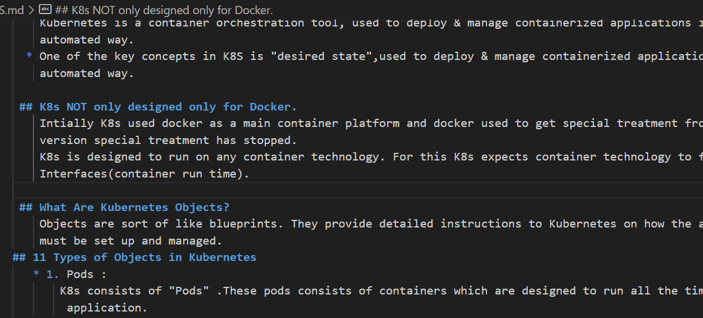
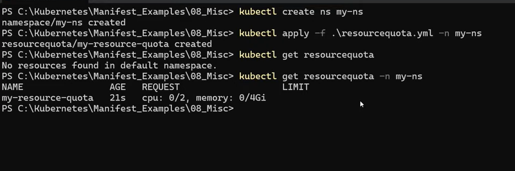
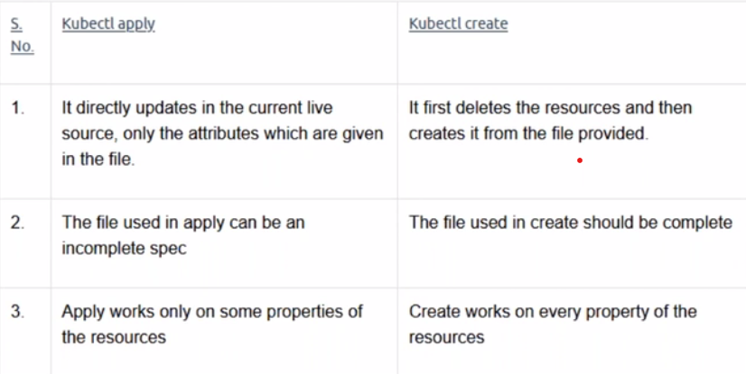
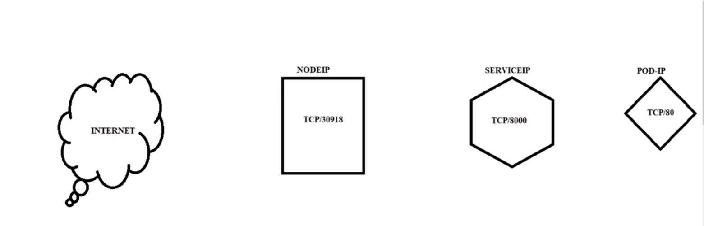
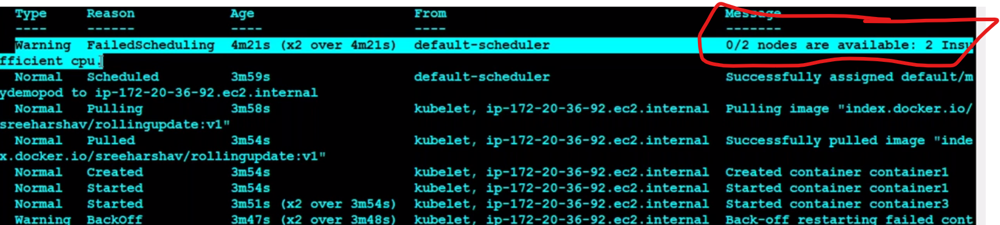

### KUBERNETES
 *  Def:
    Kubernetes is a container orchestration tool, used to deploy & manage containerized applications in an automated way.
  * One of the key concepts in K8S is "desired state",used to deploy & manage containerized applications in an     
    automated way.    
   
   * K8s provides a consistent and reliable way to manage applications regardless of whether they are running on-premises,on the cloud or in hybrid environment
 * 

What is microservices??
  * Microservices are s software architecture pattern that structure applications as a collection of small independently deployable services.
  * Each micro service is designed to perform a specific function or business capability and communicates with other services over well defined APIs or protocal.

### Kuberenetes Architechture::
K8s Architechture consists of Master & Node components
Master Server Comeponents:
  * API Server: 
        It is a component of K8S "control plane" that exposes the k8s API.The API Server is front end for k8s control plane.
  * Control Manager 
        Control plane that runs controller processes.
  * Scheduler
        Control plane component that watches for newly created Pods with no assigned node and selects a node for them to run on.
  * Etcd
       Consistent and highly-available key value store used as K8S backing store for all cluster data.
Node Consists of 
  * Kubelet
  * kubeproxy

## PODs:
* In Kubernetes a pod is the smallest and most basic unit pod deployement.
* It represent a single instance of a running process within cluster.
* A pod encapsulates one or more containers storage resources network configurations and other options required to run a specific set of containers together.
* Pods provide several benefits including resource isolation ,flexible deployement stratagies,esay scaling and enhanced reliability.
  
 ## Deployements: 
 * In k8s a Deployement is an object that provide declarative updates and management for a set of replica Pods.
 * When you create a Deployement you specify the desired state by defining the container images, number of repicas and other configuaration parameters.
 * K8s then ensures that the actual state of matches the desired state.
 * If there are any discripencies k8s automatically takes action to reconcile the state creating or deleting pos as necessary.

## ReplicaSets:
* In k8s a Replicaset is an object that ensures a specified number of replica pods are running at any given time.
* It is responsible for maintaining the desired replica count and managing lifecycle of the pods.
* Replicasets are typically used to manage statefuless applications.
* indications where individual instances of the application can be treated as interchange.
* When you create a Replicaset you specify the desired number of relicas and provide a template for creating the pods.
  
## Services::
 * In Kubernetes a service is an abstartion that provides a consistent way to access and communicate with a set of Pods.
 * It acts as a stable network endpoint for accessing the Pods enabling inter-pod communication and load balencing.

### Types of Services:
 CluterIP:
 The default Service type which exposes the service on a cluster-internal IP address.It is accessible only within the cluster.
 NodePort:
 Exposes the service on a specific port on each node in the cluster .The Service is accessible using the cluster nodes IP addresses.
 Loadbalencer:
  Provision a cloud providers load balencer to distribute to the Service.External clients can access the services using a publicly accessible IP address.
 ExternalNmae:
 Maps the services to a DNS name allowing the service to redirect requests to an external endpoint outside the cluster.

 ## ConfigMap:
 * In k8s a CM is an API object used to store configuration data that can be consumed by pods or other resources in the cluster.
 * It providers a way to decouple configuration settings from the containerized applications making it easier to manage and update configuration data without modifying the application code or container images.
* Config maps store key-value pairs or provide the ability to mount configuration files as data.
  
 ## Secrets:
 * In K8s a Secret is an API object used to store sensitive information such as passwords,tokens 0r SSH keys.
 * Secrets provide a way to securely store and manage sensitive data within a cluster.
 * Secrets can be used by applications and pods to access sensitive information without exposing it in plain text.
 * K8s Secrets are stored in the cluster's etcd datastore ,encrypted at rest.They can be accessed by pods or other k8s objects securely.

 ## There are different types of secrets in k8s:
 ## Opaque: 
   The most common type of secret.It allows you to store arbitary key-value paires as base64-encoded strings.It is suitable for storing general-purpose sensitive information.
 ## Docker-registry:
   Used for storing credentials to authenticate with a private Docker registry.It includes the server ,username,password and email fields.
  ## TLS:
    Used for storing TLS certificates and private keys.I t includes the TLS.CRT and TLS.KEY fields.

## Namespaces::
* In K8S Nmaspaces are a way to create virtual clusters within a physical cluster.
* They provide a way to divide cluster resources into logocal groups enabling multiple teams or applications to coexists and operate independently within same k8s cluster.
* Eg: Environments,projects or teams
* Each object in k8s belongs to a specific namaspace.

  ## Key points about Namespaces:
  * Creating Custom  Namespaces: You can create additional custom namespaces to organize your cluster according to your needs.
  * For example you might create namespaces like development ,staging and production to seperate environments.
  * To interact with resources within a specific namespace you can use the '-n' or '--namespcae' flag with kubectl commands.For example:
  && "kubectl get pods --namespace <namespcace-name>
     "kubectl describe deployement <deployement-name> --namespace <namespcae-name>

### Persistent volumes::
* In k8s a PV is a piece of storage provisioned in a cluster that can be dynamically allocated and managed by administrators.
* PVs provide a way to decouple storage from the lifecycle of pods and allow data to persistent beyond the life time of individual pods.
* PV serve as an abstraction layer between the physical storage (such as an network attached storage or local storage ) and the application's need for storage .
* They enable application to request storage resources without needing to known the details of the underlying infrastructure.

## Persistent Volumes-keypoints
Provisioning:
* PVs can be provisioned statically or dynamically.
* Static provisioning involves creating PVs in advance while dynamic provioning allows PVs to be created on-demand when requeste by the applications.
  ## Storage classes:
  * Dynamic proviosoning of PVs facilitated through the use of storage classes.
  * Storage classes define different classes of storage with specific charecteristics (EX..Performance ,access modes) and specify the provisioner responsible for dynamically creating the storage.
  * ## Access Modes:
  * PVs support differnt access modes to cater to different types of storage requirements.
  * The common access modes are 
       ReadWrite Once(RWO) for single node  ReadWrite access
       Read only many(ROX) for multiple nodes read only access &&
       Readwrite many(RWX) for multiple nodes read-write access.
  ## Persistent Volume key points-2
  * PVs have a lifecycle independent of the pods that use them.
  * They can be managed sepeartely from pods.
  * When a PV is no longer needed it can be released and made available for reuse.
  * The reclaim policy determines what happens to the storage when the PV is released allowing options like retaining the data , deleting the data or manual reclamation. 
  
  ## Persistent Volume Claims(PVCs)
  * PVCs in k8s have three different reclaim polices that determine what happens to the associated Persistent Volume.
  When the PVS is deleted or no longer needed.
  * Reta in:: With the retain policy the PV associated with PVC is not automatically deleted or released when the PVC is deleted.Instead the PV is retained and contents are preserved.
  * Delete: The delete policy indicates that the associated PV should be automatically deleted when the PVC is dleted.
  * Recycle(Deprecated) :This policy deprecated and no longer recomended for use.    

## PVC's
* PVC's are used by applications to request storage resources from PVs.
* PVCs define the desired charecteistics of the storage such as size,access mode and storage class.
* When a PVC is created k8s dynamically binds it to an available PV  thst matches the requirements specified in the claim.

## StatefilSets::
* Statefulsets in k8s are a workload API object used to manage stateful applications.
* Unlike the traditional deployement of stateless applications stateful applications require stable and unique network identities,stable storage and ordered and predictable deployement and scaling.
* Stateful sets are commonly used for deploying and managing stateful appllications such as databases (eg..MYSQL.PostgresSQL),Messaging systems(eg.. Kafka)and other applications that require stable network identities and persistent storage.
* Stable storage: Stateful sets provide stable and unique storage volumes for each pod.Persistent Volumes(PVs) and Persistent volume claims are used to provide storage to the pods allowing data to be persisted and retained across pod restarts and rescheling.
* Headless Service:: Stateful sets automatically create a Headless service which allows each pod to have its own DNS entry.This enables direct communication between pods using their unique hostnames.
* Stateful Pod scaling: Statefulsets support both vertical and horizental scaling.Vertical scaling involves changing
the resources(CPU and memory) allocated to ecah pod,while horizental scaling involves adding or removing pods from statefulset.
* Ordered Termination: When scaling down or terminating pods in a statefulset,K8s ensures that the pods are terminated in the reverse order of their creation.This allows for orderly application shutdown and ensures data integrity and consistency.
* Data Replication:: Since each pod in the Statefulset has own PV and PVC data replication can be handled at thr storage level.
* Many cloud-based storage solutions like Google cloud persistent disk(GCP PD) or Amazon Elastic Block Store(EBS),
* provide data replication capabilities to ensure high availability and data integrity.

## Daemonsets:
 * In k8s Daemonsets are a type of controller used that a copy of a specific pod is running on all or some of the nodes in a cluster.
 * Unlike Replicaset or Deployement that maintain a desired to run exactly one instance of a pod on each node.
 * Deamonsets are commonly used to run system services or monitoring agents on each node ensuring that these essential services are present and active throughout the cluster.

## Jobs::
* In k8s a Job is a controller object that creates one or more pods to perform a specific task and ensures that the task is completed successfully.
* Unlike other objects like Deployements or ReplicaSets which maintain a specified number of replicas running at all times a job is designed for "short-lived tasks or batch processing".
* Jobs are designed to run one or more pods to perform a task and then terminate when the task is completed.They are ideal for running batch jobs or tasks that need to be execute once.

## Horizental Pod Autoscalar::
* HPA automatically adjust the number of replicas of a Deployement,ReplicaSet or Stateful set based on observed CPU utilization or cutom metrics.
* It ensure that there are enough replicas to handle the incoming traffic and prevent overloading the cluster.
* When CPU or custom metrics exceed the defined thresholds,HPA scales up the replicas and when the metrics decrease,it scales down the replicas.

## CLSTER AUTOSCALAR::
* CA automatically adjust the size of the k8s cluster by adding or removing nodes based on the resource demands of the pods.
* I t ensure thst there are enough resources available in the cluster to accommodate the scheduled pods.

## LIMIT RANGE::
* Limit Ranges are used to specify constraints on the resouce requests and limits for pod in nmaespace.
* They help prevent pods from using excessive resources or ensure that all pods have minimum resource guarantees.
* This is control resources at "Pods level"

 ## RequestQuota::
 * Requestquota are used to limit the amount of compute resouces(CPU AND MEMORY) that can be used within a namespoace.
 * They help to control the resource consumption of all pods and containers within that namespace.
  
* This is setup control resorces at "Cluster level"

      

  ----------------------------------------------------
  

    

### Workload Components::::
* Pods
* Deployements
* Services
* Ingress
* Configmaps
* Secrets
* Namespaces
* Presistent volumes
* Persistent volume claimes
* Statefulsets 

   
 ## K8s NOT only designed only for Docker.
    Intially K8s used docker as a main container platform and docker used to get special treatment from k8s-1.24 version special treatment has stopped.
    K8s is designed to run on any container technology. For this K8s expects container technology to follow k8s Interfaces(container run time). 
     
 ## What Are Kubernetes Objects?   
    Objects are sort of like blueprints. They provide detailed instructions to Kubernetes on how the applications must be set up and managed.
## 11 Types of Objects in Kubernetes     
   * 1. Pods :
       K8s consists of "Pods" .These pods consists of containers which are designed to run all the time your 
        application.
   * 2. Deployment
        In Kubernetes, a Deployment object is used to manage the lifecycle of one or more identical Pods. A Deployment allows you to declaratively manage the desired state of your application, such as the number of replicas, the image to use for the Pods, and the resources required.
     3. ReplicaSets:
       In Kubernetes, Deployments don’t manage Pods directly. That’s the job of the ReplicaSet object. When you create a Deployment in Kubernetes, a ReplicaSet is created automatically. The ReplicaSet ensures that the desired number of replicas (copies) are running at all times by creating or deleting Pods as needed. 
     4. StatefulSet
        A StatefulSet is a Kubernetes object that is used to manage stateful applications. The word "state" means any stored data that the application or component needs to do its work. This state is typically stored in a persistent storage backend, such as a disk, or a database.  
     5. DaemonSets
        A DaemonSet ensures that a copy of a Pod is running across all, or a subset of nodes in a Kubernetes cluster.
        DaemonSets are useful for running system-level services, such as logging or monitoring agents, that need to run on every node in a cluster.  
     6. Persistent Volume:
        PersistentVolume represents a piece of storage that you can attach to your Pod(s).
        The reason it's called "persistent" is because it's not tied to the life cycle of your Pod. In other words, even if your Pod gets deleted, the PersistentVolume will survive.
     7. Service
        A Kubernetes Service is a way to access a group of Pods that provide the same functionality.             
     8. Namespaces
        A Kubernetes namespace is a way to divide a single Kubernetes cluster into multiple virtual clusters. This allows resources to be isolated from one another. Once a namespace is created, you can launch Kubernetes objects, like Pods, which will only exist in that namespace. 
    9-10. ConfigMaps & Secrets
       ConfigMaps and Secrets are two very important objects that allow you to configure the apps that run in your Pods. Configuring apps refers to setting various parameters or options that control the behaviors of the apps. This can include things like database connection strings or API keys.

       ConfigMaps are used to store non-sensitive configuration values. For example, environment variables used to provide runtime configuration information such as the URL of an external API, rather than confidential information such as passwords, are considered non-sensitive data.

       Secrets, on the other hand, are meant to hold sensitive configuration values, such as database passwords, API keys, and other information that only authorized apps should be able to access.
    11. Job
       A job object is used to run specific tasks that have the following properties:
       They are short-lived.
       They need to be executed once.
       But most importantly, Kubernetes has to make sure that the task has been executed correctly and finished its job.An example of where a Kubernetes job can be useful is a database backup. This does not run continuously, so it's a short-lived process.      
--------------------------------------------------------------

Yaml file for Cornjob:        
---
apiVersion: batch/v1
kind: CronJob
metadata:
  name: cornjob
spec:
  schedule: "* * * * *"
  jobTemplate:
    metadata: 
      name: cornjob
    spec:
      template:
        metadata:
          name: cornjob
        spec:
          containers:
            - name: alpine
              image: alpine:1.0.0
              args:
                - sleep
                - 1d   
          restartPolicy: OnFailure

-----------------
Build steps:
---------
git clone https://github.com/CICDProjects/nopCommerceJuly23.git
dotnet restore src/NopCommerce.sln
dotnet build -c Release src/NopCommerce.sln
dotnet publish -c Release src/Presentation/Nop.Web.csproj -o publish
mkdir publish/bin publish/logs
zip -r nopCommerce.zip publish

--------------------
Now create a Jenkinsfile in such a way that when a commit happens on develop branch the build creates a nopCommerce zipfile.
sudo usermod -aG docker ubuntu
Run the following command in node to connect to master:...........
----------------------
kubeadm join 172.31.83.179:6443 --token dv14rp.c9dojmnhmtc15p0u \
        --cri-socket unix:///var/run/cri-dockerd.sock \
        --discovery-token-ca-cert-hash sha256:f735c45fa7017ed88f4910b7c3c5765001b65ccf0f6120f47e76f8b426a196d7

1  install -o root -g root -m 0755 cri-dockerd /usr/local/bin/cri-dockerd
    2  install packaging/systemd/* /etc/systemd/system
    3  sed -i -e 's,/usr/bin/cri-dockerd,/usr/local/bin/cri-dockerd,' /etc/systemd/system/cri-docker.service
    4  systemctl daemon-reload
    5  systemctl enable --now cri-docker.socket
    6  install -o root -g root -m 0755 cri-dockerd /usr/local/bin/cri-dockerd
    7  exit
    8  kubeadm init --pod-network-cidr "10.244.0.0/16" --cri-socket "unix:///var/run/cri-dockerd.sock"
    9  mkdir -p $HOME/ .kube
   10  sudo cp -i /etc/kubernetes/admin.conf $HOME/.kube/config
   11  sudo chown $(id -u):$(id -g) $HOME/.kube/config
   12  kubectl get nodes
   13  kubectl apply -f https://github.com/flannel-io/flannel/releases/latest/download/kube-flannel.yml
   14  kubectl get nodes        

---------------------------------------------------
Manifets file for Deployement

---
apiVersion: apps/v1
kind: Deployment
metadata:
  name: alpine
spec:  
  minReadySeconds: 2
  replicas: 4
  selector: 
    matchLabels:
      app: deply-cip
  template:
    metadata:
      labels:
        app: deply-cip
    spec:
      containers:
        - name: alpine
          image: nginx
          ports:
          command:
            - sleep
            - 1d
---
apiVersion: v1
kind: Service
metadata:
  name: deply-cip
  labels:
    app: deply-cip
spec:
  selector: 
    app: deply-cip
  type: NodePort
  ports:
    - port: 80 
      protocol: TCP

-------------------------------------------------What is Kubernetes ConfigMap?
What is Kubernetes Secret?

How to use Kubernetes ConfigMap?
How to use Kubernetes Secret?
What is Kubernetes Ingress?
What is Kubernetes Ingress Controller?
What is Kubernetes Ingress Resource?
What is NGINX ingress?
What is NGINX ingress controller?
What is ingress resource?

Kubernetes ingress controller real-time example
What is Kubernetes Persistent Volumes?
What is Kubernetes Persistent Volume claims?

How to use Kubernetes Volumes?

&&&&&&&&&&&&&&&&&&&&&&&&&&&&&&&&&&&&&&&&&&&&&&&&&&&&&&&7

New videos data k8s
====================
************************************************************************************************************
To find the location of file in linux:::
sudo / -type f,d,l -iname apche2.* 
---> To remove the apache 
sudo apt purge apace2.

**************************************************************************************
Blue-Green Deployement:
----------------------
A blue/green deployment is a deployment strategy in which you create two separate, but identical environments. One environment (blue) is running the current application version and one environment (green) is running the new application version. Using a blue/green deployment strategy increases application availability and reduces deployment risk by simplifying the rollback process if a deployment fails. Once testing has been completed on the green environment, live application traffic is directed to the green environment and the blue environment is deprecated.
ku explain replicasets
 
* echo "alias gall=kubectl get all" >> .bashrc
* To execute above comand source .bashrc
kops get ig nodes
ku get cluster -o yaml
nano .bashrc
source .bashrc
tmax(ctrl+p+shift)---> to adjust yaml
watch -n l kubelet get rc
curl mypod1.default.svc.sreek8s.xyz:8000(data.test.svc.cluster.local. )

  
## tmux---> used to split the command window
   ctrl+b + shitf%
   ctrl+b ctrl inverted camas
* ku get pods -- v 6  ...----> to check the verbolcity of pods used for trpuble shoot   
* kubectl label pod <podname>
* 
* kubectl get pods -o <pod.yaml>---> To check the complete pod infromation..like memory,cpu
* kubectl get pods -o wide --->it will give pod,node infromation
* ku run ---> By default creates the deployement.(replica set it will craete)
* ku run --generator=run-pd/v1 testpod --image=<imagename>-----> user create(to run individual pod) new pod whlile running
* ## Replication controller;
* ## If we change the lable of the existing standalone pod similar to lable of Replica controller,then pod will come under RC scope.....The extra pod will be removed based on timestamp of new pods will be evicted /deleted.
* The scope of replication controller is decided by lable selectors.Whichever pod matches its lableswith provideded selector,that will be managed by replication controller.
* 
* ## kubectl rolling-update <oldname(version) > <new version> --image=<new_image_name>
## kubectl rolling-update <oldname(version) > <new version> --image=index.docker.io/sreeharshav/testcontainer:v1

## Drawbacks of Replication controller::
* 1.It will be manual update from one image to other image.
* 2.New RC will be created and old RC will be deleted.
* 3.Roll back needs to change again to the old image.
* 4. Overall manual process and RC rolling-update is depricated.
* ## DEPLOYEMENTS:::
* https://medium.com/nerd-for-tech/kubernetes-k8s-deployment-strategies-1ef4c1dc1c6c#:~:text=Kubernetes%20%28K8S%29%[…]28or%29%20Mirrored%20Deployment

* ### Advantages of Deployements:::
* It uses Replication sets.These RS can be used for rolling update.
* Rollback is easy we can record the deployements
* We acn use liveness & readiness probes to improve application availability.
* We can pause and resume the deployement which is useful for canary updates.(To check the new version is working properly or not then do the deployements)
* kubectl set image deployment hello name=sreeharshav/rollingupdate:v3
kubectl rollout pause deployment hello
kubectl rollout resume deployment kubia

* kubectl rollout history <deployement_name>----> Toc check the rollout history when image changes.....need to observe rs..{In mainifest file we nned specift revision historyLimit: 2147483647}
* kubectl rollout pause deployement nginx-deployement
* kubectl rollout resume deployement nginx-deployement
* ## kubectl rollout undo <gepl_name>  --to-revision=1 --record
* Max Unavailable::It is an option field that specifies the maximum nuber of pods that can be unavailable during update process

## PROBES:::(30 min dought at master ,node curl access,MANAGEMENT HOST(root))
KUBETET will perform Probes
* Readiness Porbe--->During the deployements Check the pod is ready to serve (service) the request.Tt won't send traffic.If pod is not ready it will remove from traffic.[It will run through out pods life with period secs options:10]
   *If the pod is up then only it send the traffic.otherwise it wont send raffic.
   * Readiness probe wont restart the container.it will wait it container is up.
* Liveness probe::Check the pod is responding ,if not It will restart the pod.
* To check Probes in practical will use following coomands.CMD,HTTP& TCP Socket     
* These two probes can  be used in parallel for the same container .Using both can ensure that traffic does not reach a container that is not ready for it , and that containers are requested when they fail.
### Service:
------------
It is an object used to expose  an Application running in the container or pod 0r Node to external world.
If we create service it automatically it will creates endpoints .
*Ater crationg SVC .It will go to End points then it tranfers to Node
Node Port 

What Is Kubernetes Headless Service?
Refer:::---https://kodekloud.com/blog/kubernetes-headless-service/#
In Kubernetes, Services provide a stable IP address for clients to connect to Pods. A client makes a request to the Service. Then the Service forwards that request to one of the Pods associated with it. The client does not know which Pod it is connected to, nor does it care about it.

But what if the client wants to see the Pods’ IP addresses, so that it has complete control over which Pod(s) it can connect to? In such cases, Kubernetes provides the concept of headless Services.

A Kubernetes headless Service allows a client to connect to whichever Pod it prefers, directly. It doesn’t route the client request like a regular Service does.

* When a client sends a request to a headless Service, it will get back a list of all Pods that this Service represents 
* Default K8S service is cluster Ip, when you craete a headless service by setting Cluster IP "None" ,no load -balencing is done and no cluster IP is allocated for this service.Only DNS is automatically configured.When you run a DNS query for headless service you will get the list  pods IPs and usually client dns chooses the first DNS record.
k8s describe svc deploye1 | grep -i endpoint

## INGRESS::::::::::
* Ingress exposes HTTP and HTTPS routes from outside the cluster to services within the cluster. Traffic routing is controlled by rules defined on the Ingress resource.
* The below condition is possible.
* Ingress conmtroller---->Ingress1----->service
*                    ----->ingress-2---->
*                    
## kubectl logs ingress-nginx-controller -n ingress-nginx
*https://github.com/kubernetes/ingress-nginx

https://medium.com/@madeeshafernando/deploying-multiple-ingress-controllers-in-a-kubernetes-cluster-dc6c7700a795

ku create deploy deploy1 --image=index.docker.io/sreeharshav/rollingupdate:v1
ku create deploy deploy2 --image=index.docker.io/sreeharshav/rollingupdate:v3
ku create deploy deploy3 --image=index.docker.io/sreeharshav/testcontainer:v1
ku create deploy devopsk8s --image=index.docker.io/sreeharshav/testcontainer:v1
ku create deploy apple1 --image=index.docker.io/sreeharshav/testcontainer:v1 -n apple
ku expose deploy deploy1 --port=5000 --target-port=80 --type=NodePort
ku expose deploy deploy2 --port=8000 --target-port=80
ku expose deploy deploy3 --port=9000 --target-port=80
ku expose deploy devopsk8s --port=8200 --target-port=80
ku expose deploy apple1 --port=5000 --target-port=80 -n apple

%%%%%%%%%%%%%%%%%%%%%%%%%%%%%%%%%%%%%%%%555
canary update

ll .ssh/
while true
do
curl -s 
sleep 
1s 
done

## Replication set:
It is used based on Matche lables and  match expressions
Example::
 * spec:
  # modify replicas according to your case
  replicas: 3
  selector:
    matchLabels:
      tier: frontend
  template:
    metadata:
      labels:
        tier: frontend
        -----------------------

matchExpressions:
      - {key: app, operator: In, values: [soaktestrs, soaktestrs, soaktest]}
      - {key: teir, operator: NotIn, values: [production]}
  template:
     metadata:
       app: soaktesters
## ReplicaSets are declared in essentially the same way as ReplicationControllers, except that they have more options for the selector.
---------------
## Blue green vs Rolling update

watch kops valodate cluster

* Mostly used commands in Real time 
* get,update,upgrade,validate,rolling update(instance level upgrade
ku get pods -A
** If we delete namespace everything inside it will be deleted.
* Pod will any any no of containers.Foe all these containers have only one IP addresss i.e pod's ip address
  ## Pod----> Docker run && Deployrment---->Docker service
  * alias ku='kubectl'
  * kubectl run testpod1 --image=ngix:latest(we can give our own repo image name)
  * ku edit pod <podname>
  * ku expose pod <podname> --port=8000 --target-port=80 --type=NOdePort(to exposre the pod outside)
  * -----------------------
  * curl http://localhost:8888
  * ku port-forward pog/testpod2 8888:80
  * kubectl exec pods -it -- /bin
  * kube calic
  * calico:third party plugin will provode network and communicates between pods.
  * kubectl
  * kubeadmin
  * ku craete -f pod-yaml
  * ku get pods -n ns1 
    ku get pods -n ns2
    ku get pods -n ns1 -o  yaml
    ku exec -it memory-pod -n ns1 -- bash
    ping 100.0.2.45
## Runcontainerrun error--> is due unable to fing the image
   *kubectl get pods -l name=dev(decisison making)
   Using lables we can decision making ang by annotations randomly making
   

   kubectl get pods mypod --show=lables
   
  
  ## If we trying to run more than one container in a pod will get follwing error
  
  
  FOR ONE MASTER and one node we are running...So if we not specify the pod CPU it will take default value in that if we are trying to run 3 containers it will "crash".So we have to run one container in one pod.

  # metedata: the set of data that describes the information about the other data

  ## kubectl get pods --output=wide ---> To check pods are running in which node

  

    
      

           
